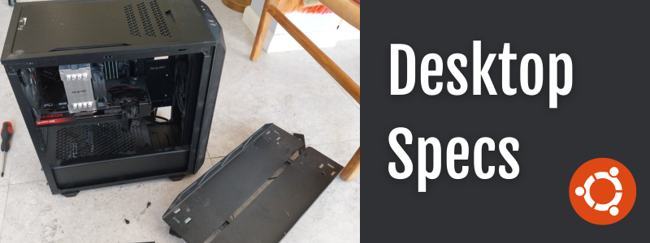

# 🖥️ Daniel's Workstation Spec Sheet

**Last updated: April 16, 2025**

This is a public spec sheet for my current desktop setup. I use it frequently to ground AI tools with my hardware context, especially when working with custom agents that benefit from knowing system limitations or capabilities. It’s proven invaluable when planning upgrades, debugging performance issues, or managing AI workloads.

## 💡 Why This Exists

- Ground AI tools and assistants with real hardware specs.
- Easily reference my own setup when configuring tools across environments.
- Help others in Israel (and elsewhere) working with similar constraints or availability.

## ⚙️ System Overview

| Component      | Specification                                                  |
|----------------|----------------------------------------------------------------|
| **OS**         | Ubuntu 24.10 (KDE Plasma)                                      |
| **CPU**        | Intel Core i7-12700F (12 Cores / 20 Threads, up to 4.9 GHz)    |
| **GPU**        | AMD Radeon RX 7700 XT (gfx1101, 12 GB VRAM, ROCm 6.12.12)      |
| **RAM**        | 64 GB DDR5 @ 4800 MT/s                                         |
| **Storage**    | 4.62 TiB SSD total (BTRFS, RAID5), ~4.51 TiB usable            |
| **File System**| BTRFS (RAID5 for data, RAID1 for system/meta)                  |
| **Motherboard**| Maxed out SATA/NVMe ports; no more disks can be added         |

## 📦 BTRFS Storage Pool Configuration

Although this system came with a fast NVMe drive, I opted to pool it together with four SATA SSDs for a large unified volume. This mixed setup is suboptimal in performance (as SATA can bottleneck the NVMe), but it gave me the storage density and redundancy I needed using RAID5.

| Device       | Type   | Capacity | Role         |
|--------------|--------|----------|--------------|
| `/dev/nvme0n1` | NVMe SSD | 1 TB     | Part of RAID5 pool |
| `/dev/sda`     | SATA SSD | 1 TB     | Part of RAID5 pool |
| `/dev/sdb`     | SATA SSD | 1 TB     | Part of RAID5 pool |
| `/dev/sdc`     | SATA SSD | 1 TB     | Part of RAID5 pool |
| RAID Level   | —      | RAID5    | ~3 TiB usable (plus parity) |

Note: This is not ideal for I/O-heavy workloads that rely on NVMe speeds, but it works well for large AI datasets and redundancy.

## 🛠️ Installation Notes

- Tried ZFS first, but found setup too fragile across multiple drives.
- BTRFS has been solid so far: easy snapshots, good balance of flexibility and performance.
- Ran Fedora and OpenSUSE for a while, but returned to Ubuntu due to stronger AMD ROCm support and easier management.

## 📈 Coming Soon (Maybe)

- Benchmarks for AI performance (ROCm and mixed workloads)
- Real-world snapshot usage and compression stats
- Example scripts for grounding AI agents with this spec 